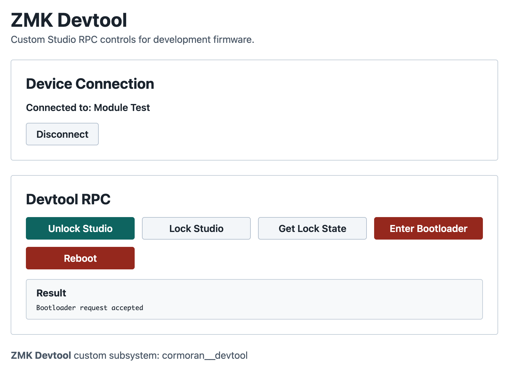

# cormoran's ZMK Devtool Module


[](https://github.com/cormoran/zmk-module-devtool/actions/workflows/zmk-module.yml)

This repository contains a ZMK module that exposes custom ZMK Studio RPC methods useful for scripted keyboard and module development.

The module uses the **unofficial** custom ZMK Studio RPC protocol and requires a ZMK build that includes custom Studio RPC support.

## Features

- Set ZMK Studio lock state to locked or unlocked.
- Get the current ZMK Studio lock state.
- Enter bootloader mode.
- Reboot the keyboard firmware.
- Optional React web UI for invoking the RPC methods from a browser.

The custom subsystem identifier is `cormoran__devtool`. Its security level is unsecured so automation can unlock Studio before sending secured Studio RPC requests.



## Module User Guide

1. Add this module and a patched ZMK with custom Studio RPC support to your `config/west.yml`.

   ```yml
   manifest:
     remotes:
       - name: cormoran
         url-base: https://github.com/cormoran
     projects:
       - name: zmk-module-devtool
         remote: cormoran
         revision: main
         import: true

       - name: zmk
         remote: cormoran
         revision: main+custom-studio-protocol
         import:
           file: app/west.yml
   ```

2. Enable the module and Studio RPC in your `config/<shield>.conf`.

   ```conf
   CONFIG_ZMK_STUDIO=y
   CONFIG_ZMK_DEVTOOL=y
   CONFIG_ZMK_DEVTOOL_STUDIO_RPC=y

   # Useful for USB serial Studio RPC during local testing.
   CONFIG_ZMK_STUDIO_RPC_RX_BUF_SIZE=128
   CONFIG_ZMK_LOW_PRIORITY_THREAD_STACK_SIZE=2048
   ```

3. Build and flash your firmware as usual.

4. Use the custom RPC subsystem `cormoran__devtool`.

   The protobuf schema is defined in `proto/cormoran/devtool/devtool.proto`.

### RPC Methods

- `set_studio_lock_state`
  - `STUDIO_LOCK_STATE_UNLOCKED` unlocks ZMK Studio without pressing a key.
  - `STUDIO_LOCK_STATE_LOCKED` locks ZMK Studio again.
- `get_studio_lock_state`
  - Returns the current Studio lock state.
- `enter_bootloader`
  - Acknowledges the request, then reboots into bootloader mode after a short delay.
- `reboot`
  - Acknowledges the request, then performs a warm reboot after a short delay.

Because this module can unlock Studio and reboot the device without physical input, enable it only in development or controlled test firmware.

## Web UI

See [web/README.md](./web/README.md) for web UI development instructions.

Published GitHub Pages builds are served from `https://cormoran.github.io/zmk-module-devtool/`.

## Module Development Guide

### Setup for Running Tests

#### Option0: Dev Container

Open this repository in VS Code with the Dev Containers extension. The container initializes the west workspace using the isolated layout.

#### Option1: west Workspace Directory Layout

Set west topdir as the parent of this repository and download dependencies under the parent workspace. This layout is useful for sharing dependencies with other Zephyr modules. Build output is located in `../build`.

```bash
mkdir west-workspace
cd west-workspace
git clone <this repository>
cd zmk-module-devtool
west init -l . --mf west/west-test-workspace.yml
west update --narrow
west zephyr-export
```

#### Option2: Isolated Directory Layout

Set west topdir as the repository root and download dependencies under `./dependencies`. Dev container and GitHub Actions use this layout. Build output is located in `./build`.

```bash
git clone <this repository>
cd zmk-module-devtool
west init -l west --mf west-test-isolated.yml
west update --narrow
west zephyr-export
```

### Pre-commit

Every commit should pass pre-commit verification.

```bash
pip install pre-commit
pre-commit install
pre-commit run --all-files
```

### Running Tests

```bash
# Run unit test and build test.
python3 -m unittest

# Run build test directly.
west zmk-build tests/zmk-config

# Run unit test directly.
west zmk-test tests -m .

# Run web tests.
cd web && npm test
```
