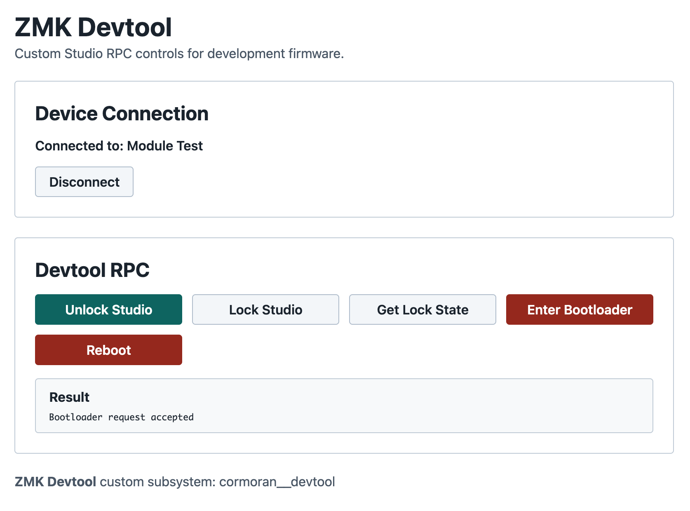

# cormoran's ZMK Devtool Module


[](https://github.com/cormoran/zmk-module-devtool/actions/workflows/zmk-module.yml)

This repository contains a ZMK module that exposes custom ZMK Studio RPC methods useful for scripted keyboard and module development.

The module uses the **unofficial** custom ZMK Studio RPC protocol and requires a ZMK build that includes custom Studio RPC support.

## Features

- Set ZMK Studio lock state to locked or unlocked.
- Get the current ZMK Studio lock state.
- Enter bootloader mode.
- Reboot the keyboard firmware.
- Get/set/toggle runtime layer activation.
- Inject virtual key presses (and releases) without touching hardware.
- Tap a running log of position/keycode/layer/modifier events for verifying what an injected (or real) key press did.
- Pull captured Zephyr log records without a debug probe.
- Optional React web UI for invoking the RPC methods from a browser.

The custom subsystem identifier is `cormoran__devtool`. Its security level is unsecured so automation can unlock Studio before sending secured Studio RPC requests.

Key injection, the event tap and log capture are each behind their own Kconfig option (see below) and are meant for development/test firmware only -- the event tap in particular can observe every keystroke.



## Module User Guide

1. Add this module and a patched ZMK with custom Studio RPC support to your `config/west.yml`.

   ```yml
   manifest:
     remotes:
       - name: cormoran
         url-base: https://github.com/cormoran
     projects:
       - name: zmk-module-devtool
         remote: cormoran
         revision: main
         import: true

       - name: zmk
         remote: cormoran
         revision: main+custom-studio-protocol
         import:
           file: app/west.yml
   ```

2. Enable the module and Studio RPC in your `config/<shield>.conf`.

   ```conf
   CONFIG_ZMK_STUDIO=y
   CONFIG_ZMK_DEVTOOL=y
   CONFIG_ZMK_DEVTOOL_STUDIO_RPC=y

   # Useful for USB serial Studio RPC during local testing.
   CONFIG_ZMK_STUDIO_RPC_RX_BUF_SIZE=128
   CONFIG_ZMK_LOW_PRIORITY_THREAD_STACK_SIZE=2048
   ```

   Layer state (`CONFIG_ZMK_DEVTOOL_LAYER_STATE`) is on by default once Studio RPC is enabled. Key injection, the event tap and log capture are opt-in and need a bigger TX buffer for their multi-record responses:

   ```conf
   CONFIG_ZMK_DEVTOOL_KEY_INJECTION=y
   CONFIG_ZMK_DEVTOOL_EVENT_TAP=y
   CONFIG_ZMK_DEVTOOL_LOG_CAPTURE=y
   CONFIG_ZMK_STUDIO_RPC_TX_BUF_SIZE=384
   ```

3. Build and flash your firmware as usual.

4. Use the custom RPC subsystem `cormoran__devtool`.

   The protobuf schema is defined in `proto/cormoran/devtool/devtool.proto`.

### RPC Methods

**Core** (`CONFIG_ZMK_DEVTOOL_STUDIO_RPC`)

- `set_studio_lock_state`
  - `STUDIO_LOCK_STATE_UNLOCKED` unlocks ZMK Studio without pressing a key.
  - `STUDIO_LOCK_STATE_LOCKED` locks ZMK Studio again.
- `get_studio_lock_state`
  - Returns the current Studio lock state.
- `enter_bootloader`
  - Acknowledges the request, then reboots into bootloader mode after a short delay.
- `reboot`
  - Acknowledges the request, then performs a warm reboot after a short delay.

Because this module can unlock Studio and reboot the device without physical input, enable it only in development or controlled test firmware.

**Layer state** (`CONFIG_ZMK_DEVTOOL_LAYER_STATE`, on by default)

- `get_layer_state` -- returns the active-layers bitmask and the highest active layer. The default layer is always reported active, matching ZMK's own fallback rule.
- `set_layer_state` -- momentary activate/deactivate a layer (mirrors `&mo`/`&to`), optionally locking it like `&tog`.
- `toggle_layer` -- activate if inactive, deactivate if active.

**Key injection** (`CONFIG_ZMK_DEVTOOL_KEY_INJECTION`)

- `inject_key` -- raises the same `zmk_position_state_changed` event a real matrix scan would, so combos, hold-taps and behaviors all see it.
- `tap_key` -- presses then schedules a release after `hold_ms`. Only one tap can be pending at a time; a second call while one is in flight is rejected.

**Event tap** (`CONFIG_ZMK_DEVTOOL_EVENT_TAP`)

Poll-based observation of position/keycode/layer/modifier events, so you can verify what an injected (or real) key press actually did.

- `subscribe_events` -- sets a bitmask of event types to capture (`0` disables the tap and drops buffered content).
- `get_events` -- cursor-based drain; pass back `next_cursor` to continue without gaps, `dropped_count` reports records overwritten between polls.
- `clear_events` -- empties the buffer.

This can observe every keystroke -- development/test firmware only.

**Log capture** (`CONFIG_ZMK_DEVTOOL_LOG_CAPTURE`)

Adds a Zephyr log backend that mirrors captured records into a RAM ring buffer, retrievable without a debug probe.

- `get_logs` -- cursor-based drain, same shape as `get_events`.
- `clear_logs` -- empties the buffer.
- `set_log_capture_filter` -- overrides the minimum captured level globally (empty `source`) or for one log source.
- `set_log_streaming` -- turns push-mode on/off (see below).

The capture backend defaults to `INF` (`CONFIG_ZMK_DEVTOOL_LOG_CAPTURE_DEFAULT_LEVEL`), which is below the Studio RPC dispatch/transport's own `DBG`-level logging -- calling `get_logs` does not feed its own chatter back into the buffer it just read from. Raise a specific source to `DBG` at runtime with `set_log_capture_filter` instead of lowering the default.

**Streaming (push) mode** (`CONFIG_ZMK_DEVTOOL_LOG_CAPTURE_STREAMING`, default on)

Instead of polling `get_logs`, call `set_log_streaming{enabled: true}` and the firmware pushes a `LogStreamNotification` (a `Notification` custom-subsystem notification) with newly captured records. Streaming starts from "now" (use `get_logs` for the existing backlog) and keeps its own cursor, so polling and streaming can be used together. `dropped_count` reports records lost if the client falls behind. Remember to `set_log_streaming{enabled: false}` when done -- while a Studio client stays connected the notifications keep flowing.

The draining, notification encoding and transmit run as a periodic work item on ZMK's low-priority work queue (poll interval `CONFIG_ZMK_DEVTOOL_LOG_CAPTURE_STREAM_INTERVAL_MS`, default 50 ms), never on the logging subsystem's own thread. Each invocation pushes at most `CONFIG_ZMK_DEVTOOL_LOG_CAPTURE_STREAM_MAX_RECORDS_PER_WORK` records (default 30) and then yields; if records are still buffered it re-enqueues immediately (with no delay) rather than waiting a full interval. This bounds how long a single invocation can hold the shared low-priority work queue, so a sustained log flood can no longer starve other low-priority work, while the immediate re-enqueue keeps throughput high.

To avoid streaming feeding itself, the notification send deliberately does **not** emit the Studio RPC's usual `Encoding custom response` `DBG` line, so a push generates no captured log of its own (in any log mode). If you lower capture to `DBG` while streaming and see the Studio transport's own chatter, silence it with `set_log_capture_filter{source: "zmk_studio", min_level: ERR}` -- it logs under its own `zmk_studio` source, separate from `zmk`. (Note that `DBG`-level Studio logging still appears on the console/RTT regardless -- the capture backend only affects what devtool captures, not other log backends.)

## Web UI

See [web/README.md](./web/README.md) for web UI development instructions.

Published GitHub Pages builds are served from `https://cormoran.github.io/zmk-module-devtool/`.

## Module Development Guide

### Setup for Running Tests

#### Option0: Dev Container

Open this repository in VS Code with the Dev Containers extension. The container initializes the west workspace using the isolated layout.

#### Option1: west Workspace Directory Layout

Set west topdir as the parent of this repository and download dependencies under the parent workspace. This layout is useful for sharing dependencies with other Zephyr modules. Build output is located in `../build`.

```bash
mkdir west-workspace
cd west-workspace
git clone <this repository>
cd zmk-module-devtool
west init -l . --mf west/west-test-workspace.yml
west update --narrow
west zephyr-export
```

#### Option2: Isolated Directory Layout

Set west topdir as the repository root and download dependencies under `./dependencies`. Dev container and GitHub Actions use this layout. Build output is located in `./build`.

```bash
git clone <this repository>
cd zmk-module-devtool
west init -l west --mf west-test-isolated.yml
west update --narrow
west zephyr-export
```

### Pre-commit

Every commit should pass pre-commit verification.

```bash
pip install pre-commit
pre-commit install
pre-commit run --all-files
```

### Running Tests

```bash
# Run unit test and build test.
python3 -m unittest

# Run build test directly.
west zmk-build tests/zmk-config

# Run unit test directly.
west zmk-test tests -m .

# Run web tests.
cd web && npm test
```
